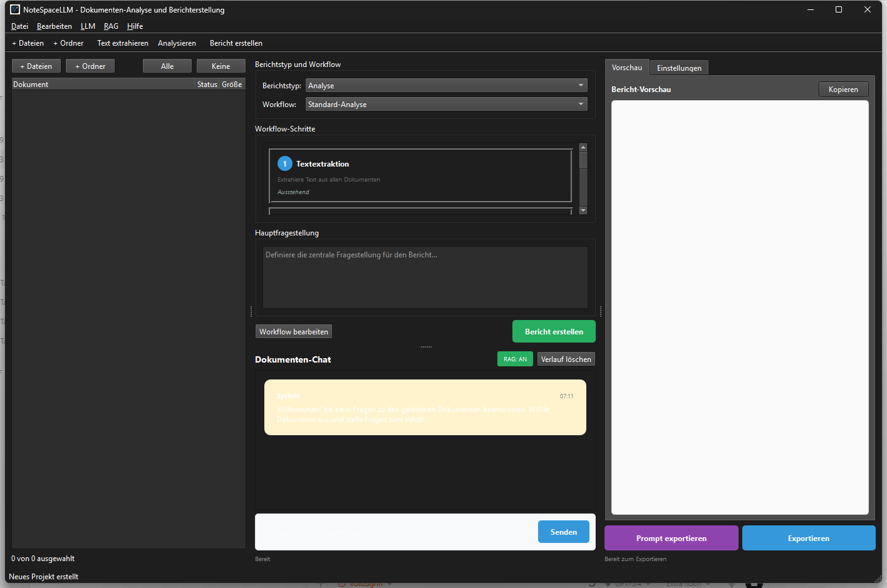

<p align="center">
  
</p>

# NoteSpaceLLM

**Local NotebookLM alternative for private document analysis, RAG-assisted research, and multi-format report generation.**

NoteSpaceLLM is an offline-first PySide6 desktop app for working with PDFs,
Word files, Markdown, mail exports, notes, and research folders. It keeps
project data local by default, supports local or remote Ollama, OpenAI,
Anthropic and Claude Code workflows, and exports analysis results to Markdown,
PDF, DOCX, HTML and TXT. A lightweight Web/PWA Companion is now available for
reviewing exported workspaces on Android, iOS and browser devices without
uploading documents to a server.

**Best-fit searches:** NotebookLM alternative, local RAG document analysis,
private document chat, PySide6 research tool, offline AI report generator,
local-first document workflow.

## Quick Start

```bash
git clone https://github.com/file-bricks/NoteSpaceLLM.git
cd NoteSpaceLLM
pip install -r requirements.txt
python main.py
```

On Windows you can also launch via `start.bat`. A local Windows launcher can be built with `build_exe.bat`.

Run tests and compile smoke checks with:

```bash
python -m unittest discover -s tests -v
python -m compileall -q main.py manage_translations.py translator.py src
cd web_companion
node --test tests/library.test.mjs
```

## Screenshots




## Features

- **Document management**: Add files and directories via drag & drop
- **Auto-indexing**: New documents are processed and indexed immediately for RAG
- **Selective analysis**: Check/uncheck documents to include or exclude from reports
- **Sub-queries**: Right-click a document for targeted document-specific research
- **Workflow visualization**: Graphical overview of the report pipeline
- **Chat interface**: Interactive chat over loaded documents with any LLM
- **Claude Code integration**: Structured API responses or hand-off to an interactive Claude Code session
- **Multi-format export**: Output to MD, PDF, DOCX, HTML, TXT
- **Prompt export**: Save the report context as a Markdown prompt for external LLM workflows
- **Remote Ollama per project**: Configurable server URL and API key per project
- **6-language i18n**: Interface translations for de, en, es, zh, ja, ru
- **Umlaut-safe UI**: German UI strings use native umlauts; the translation scanner avoids English false positives
- **Profiles**: Reusable output-format combinations

## Installation

```bash
# Clone or copy the project folder
cd NoteSpaceLLM

# Install dependencies
pip install -r requirements.txt

# Start the app
python main.py
```

Check dependencies:

```bash
python main.py --check
```

## LLM Configuration

### Ollama (Local — Recommended)

1. [Install Ollama](https://ollama.ai)
2. Download a model: `ollama pull llama3`
3. In the app: Menu > LLM > Use Ollama

### Ollama (Remote Server)

NoteSpaceLLM can connect to a remote Ollama server, e.g. via [ellmos-stack](https://github.com/ellmos-ai/ellmos-stack):

1. In the app: Menu > LLM > Settings
2. **Ollama URL:** `http://your-server:11435` (or your port)
3. **API Key:** If the server is behind an auth proxy (recommended)

> **Tip:** Ollama has no built-in authentication. For remote access, use a reverse proxy (e.g. Nginx) with API key or Basic Auth.

### OpenAI

```bash
export OPENAI_API_KEY="<your-openai-api-key>"
```

### Anthropic (Claude)

```bash
export ANTHROPIC_API_KEY="<your-anthropic-api-key>"
```

### Claude Code

Requires the local CLI:

```bash
npm install -g @anthropic-ai/claude-code
```

Two modes are available in the app:
- **API mode**: structured response returned directly into NoteSpaceLLM
- **Chat mode**: hands the prompt off to an interactive Claude Code console

## Usage

### 1. Add Documents

- **Drag & Drop**: Drop files or folders into the left panel
- **Button**: "Add files" or "Add folder"

### 2. Select Documents

- Checkbox: include/exclude documents for analysis
- Buttons: "All" / "None" for bulk selection

### 3. Sub-queries (optional)

Right-click a document:
- **Create summary**: Automatic summary
- **Extract information**: Find specific data
- **Analyse**: Targeted analysis
- **Ask question**: Specific question about the document

### 4. Define main question

Enter the central research question in the workflow panel.

### 5. Choose workflow/report type

- **Analysis**: Comprehensive analysis with recommendations
- **Summary**: Short summary
- **Research report**: Academic structure
- **Comparison**: Systematic document comparison

### 6. Generate report

Click "Create report" — output appears in the right panel.

### 7. Export

Select output formats and click "Export".

### 8. Prompt export

Use **"Export prompt"** to save the current working context as a Markdown file for use in Claude Code or other LLM workflows.

## Web/PWA Companion

Under `web_companion/` is a read-only Companion strand for Android, iOS and
browser. It imports exported `notespacellm-workspace-v1.json` files locally in
the browser, shows the report, document metadata and selected excerpts, restores
the last loaded workspace locally for offline starts, and can export review
notes as Markdown.

Local browser test:

```powershell
$env:PYTHONIOENCODING='utf-8'
python -m http.server 8765 -d web_companion
```

Companion smokes:

```powershell
cd web_companion
node --test tests/library.test.mjs
```

The Android/iOS PWA test plan is documented in `web_companion/PWA_TESTPLAN.md`.

## Platform Strategy

The desktop app remains the authoritative full version for local documents, RAG
index, LLM providers and confidential work. For Android, iOS and browser a
Web/PWA Companion is planned as a separate strand, exchanging data via
`notespacellm-workspace-v1.json`. Details in `PORTIERUNGSPLAN.md` and
`EXPORTFORMAT.md`.

### macOS and Linux Source Smokes

Additional source smokes run in GitHub Actions:
- `tests/platform_smoke.py` — offscreen PySide6 start, document import, report export, workspace JSON export
- `tests/linux_platform_smoke.py` — Linux-specific wrapper on `ubuntu-latest`

## Project Structure

```
NoteSpaceLLM/
├── main.py                 # Entry point
├── requirements.txt        # Dependencies
├── translator.py           # i18n system (6 languages)
├── locales/                # Translation files
├── src/
│   ├── core/              # Core functionality
│   │   ├── document_manager.py
│   │   ├── text_extractor.py
│   │   ├── sub_query.py
│   │   └── project.py
│   ├── gui/               # PySide6 UI
│   │   ├── main_window.py
│   │   ├── document_panel.py
│   │   ├── workflow_panel.py
│   │   ├── chat_panel.py
│   │   └── output_panel.py
│   ├── llm/               # LLM integration (local + remote)
│   │   ├── client.py
│   │   ├── ollama_client.py
│   │   ├── openai_client.py
│   │   └── anthropic_client.py
│   └── reports/           # Report generation
│       ├── generator.py
│       ├── templates.py
│       └── exporter.py
├── web_companion/         # PWA Companion
├── data/                  # Project data (gitignored)
├── workflows/             # Workflow definitions
├── profiles/              # Output profiles
└── output/                # Exported reports
```

## Supported File Formats

| Format | Read | Write |
|--------|------|-------|
| PDF    | ✅   | ✅    |
| DOCX   | ✅   | ✅    |
| DOC    | ⚠️   | —     |
| TXT    | ✅   | ✅    |
| MD     | ✅   | ✅    |
| XLSX   | ✅   | —     |
| HTML   | —    | ✅    |
| EML    | ✅   | —     |
| MSG    | ✅   | —     |

⚠️ .doc requires antiword or LibreOffice

## Privacy

NoteSpaceLLM stores project data, document indexes, profiles, workflow settings,
and exports locally in `data/`, `profiles/`, `workflows/`, `output/` and
`chroma_db/`. These folders are intentionally excluded from Git.

When external LLM providers (OpenAI, Anthropic, Claude Code, remote Ollama)
are enabled, prompts and selected document excerpts may be transmitted to those
services. For confidential documents use local models and review folder contents
before sharing.

## Tips

1. **Large document sets**: Select only relevant documents first for faster results
2. **Sub-queries**: Use targeted sub-queries for higher-quality analysis
3. **Ollama**: Recommended for privacy and offline use
4. **Workflow ordering**: Steps can be reordered in the workflow panel

## License

AGPL v3 — see [LICENSE](LICENSE)

This project uses PySide6 (LGPL) and PyMuPDF (AGPL).

---

## Deutsch

Ein lokaler, datenschutzfreundlicher Ersatz für Google NotebookLM zur Dokumentenanalyse und Berichterstellung.

### Features

- **Dokumentenverwaltung**: Dateien und Verzeichnisse per Drag & Drop hinzufügen
- **Automatische Extraktion & Auto-Indexierung**: Neue Dokumente werden direkt verarbeitet und für RAG vorbereitet
- **Selektive Auswahl**: Dokumente für Berichterstellung auswählen/abwählen
- **Detailrecherchen**: Rechtsklick für dokumentspezifische Analysen (Sub-Queries)
- **Workflow-Visualisierung**: Grafische Darstellung des Berichtsprozesses
- **Chat-Interface**: Interaktives Chatten über die Dokumente mit LLM
- **Claude Code Integration**: Wahlweise strukturierte API-Antworten oder Übergabe an eine interaktive Claude-Code-Session
- **Multi-Format-Export**: Ausgabe in MD, PDF, DOCX, HTML, TXT
- **Prompt-Export**: Berichtskontext als Markdown-Prompt für externe LLM-Workflows exportieren
- **Remote-Ollama pro Projekt**: Eigene Base-URL und API-Key für lokale oder entfernte Ollama-Server
- **6-Sprachen-i18n**: Übersetzungen für de, en, es, zh, ja, ru
- **Umlaut-sichere Oberfläche**: Deutsche UI-Texte verwenden echte Umlaute; der Übersetzungs-Scan vermeidet englische False Positives
- **Profile**: Wiederverwendbare Ausgabeformat-Kombinationen

### Installation

```bash
cd NoteSpaceLLM
pip install -r requirements.txt
python main.py
```

Unter Windows alternativ per `start.bat`. Build: `build_exe.bat`

### LLM-Konfiguration

#### Ollama (Lokal — Empfohlen)

1. [Ollama installieren](https://ollama.ai)
2. Modell herunterladen: `ollama pull llama3`
3. In der App: Menü > LLM > Ollama verwenden

#### Ollama (Remote-Server)

Konfigurierbare Server-URL und API-Key pro Projekt. Kompatibel mit [ellmos-stack](https://github.com/ellmos-ai/ellmos-stack).

#### OpenAI / Anthropic (Claude)

```bash
export OPENAI_API_KEY="..."
export ANTHROPIC_API_KEY="..."
```

### Verwendung

1. Dokumente hinzufügen (Drag & Drop oder Buttons)
2. Dokumente auswählen (Checkboxen)
3. Optional: Detailrecherchen per Rechtsklick
4. Hauptfragestellung eingeben
5. Workflow/Berichtsart wählen
6. „Bericht erstellen" klicken
7. Ergebnis exportieren (MD, PDF, DOCX, HTML, TXT)
8. Optional: „Prompt exportieren" für externe LLM-Workflows

### Plattformstrategie

Desktop-App als autoritative Vollversion. Web/PWA-Companion für Android, iOS und Browser über `notespacellm-workspace-v1.json`. Details in `PORTIERUNGSPLAN.md` und `EXPORTFORMAT.md`.

---

## Haftung / Liability

Dieses Projekt ist eine **unentgeltliche Open-Source-Schenkung** im Sinne der §§ 516 ff. BGB. Die Haftung des Urhebers ist gemäß **§ 521 BGB** auf **Vorsatz und grobe Fahrlässigkeit** beschränkt. Ergänzend gelten die Haftungsausschlüsse der GNU Affero General Public License v3.0, insbesondere §§ 15–16.

Nutzung auf eigenes Risiko. Keine Wartungszusage, keine Verfügbarkeitsgarantie, keine Gewähr für Fehlerfreiheit oder Eignung für einen bestimmten Zweck.

This project is an unpaid open-source donation. Liability is limited to intent and gross negligence (§ 521 German Civil Code). Use at your own risk. No warranty, no maintenance guarantee, no fitness-for-purpose assumed.
