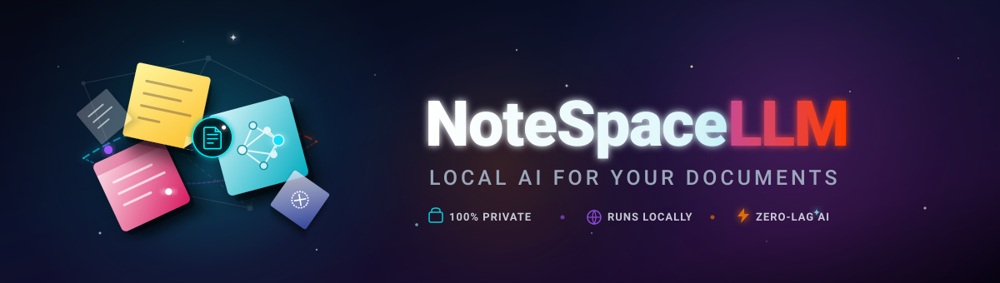
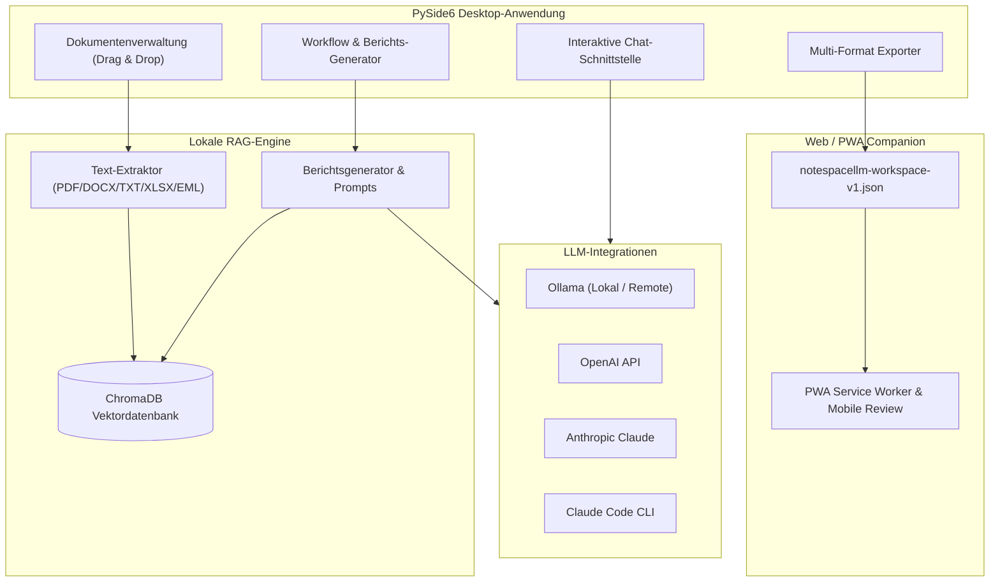

# NoteSpaceLLM

[](LICENSE)
[](https://www.python.org/)
[]()
[]()
[]()
[]()
[](https://github.com/file-bricks)
[](https://github.com/open-bricks)
[](llms.txt)

[Deutsch](README_de.md) | [English](README.md)

> **Lokale NotebookLM-Alternative für private Dokumentenanalyse, RAG-gestützte Recherche und berichtsbasierte Workflows.**

> [!NOTE]
> **Für KI-Agenten & automatisierte Systeme:**
> NoteSpaceLLM bietet eine maschinenlesbare Architektur- und Funktionsübersicht in [`llms.txt`](llms.txt).
> Sämtliche Unit-Tests (`pytest`) und Web-Companion-Tests (`npm test` in `web_companion/`) laufen vollständig offline ohne externe Netzwerkabhängigkeiten.

Analyse lokaler Dokumente (PDF, DOCX, TXT, Markdown, XLSX, EML, MSG) ohne Upload auf fremde Server. Unterstützt lokale und externe Ollama-Server, OpenAI, Anthropic sowie Claude-Code-Workflows. Ergebnisse lassen sich in Markdown, PDF, DOCX, HTML und TXT exportieren. Mit dem Web/PWA-Companion können exportierte Workspaces auch unterwegs auf Smartphone oder Tablet (Android/iOS) eingesehen werden.

## Schnellstart

```bash
git clone https://github.com/file-bricks/NoteSpaceLLM.git
cd NoteSpaceLLM
pip install -r requirements.txt
python main.py
```

Unter Windows kann die Anwendung auch über `start.bat` gestartet werden. Ein Windows-Executable lässt sich mit `build_exe.bat` bauen.

Tests und Kompilierungs-Checks ausführen:

```bash
pytest
python -m compileall -q main.py manage_translations.py translator.py src
cd web_companion
npm test
```

## Systemarchitektur



## Hauptfunktionen

- **Dokumentenverwaltung**: Dateien und Ordner per Drag & Drop hinzufügen
- **Auto-Indizierung**: Neue Dokumente werden sofort für die RAG-Vektordatenbank (ChromaDB) verarbeitet
- **Selektive Analyse**: Dokumente gezielt per Checkbox für Berichte aktivieren oder deaktivieren
- **Unteranfragen (Sub-queries)**: Rechtsklick auf Dokumente für gezielte Einzeldokument-Recherche
- **Workflow-Visualisierung**: Grafische Übersicht der Berichtspipeline
- **Chat-Schnittstelle**: Interaktiver Chat über alle geladenen Dokumente mit beliebigen LLMs
- **Claude Code Integration**: Strukturierte Antwort-Prompts oder Übergabe an eine interaktive Claude-Code-Session
- **Multi-Format Export**: Ausgabe nach MD, PDF, DOCX, HTML, TXT
- **Prompt Export**: Kontext als Markdown-Prompt für externe KI-Tools speichern
- **Remote Ollama pro Projekt**: Konfigurierbare Server-URL und API-Schlüssel je Projekt
- **Mehrsprachigkeit (6 Sprachen)**: Benutzeroberfläche auf Deutsch, Englisch, Spanisch, Chinesisch, Japanisch und Russisch
- **Web/PWA Companion**: Lokale PWA zur Durchsicht exportierter Workspaces auf Mobilgeräten

## Installation & Abhängigkeiten

```bash
# Repository klonen
cd NoteSpaceLLM

# Python-Abhängigkeiten installieren
pip install -r requirements.txt

# Anwendung starten
python main.py
```

Abhängigkeiten überprüfen:

```bash
python main.py --check
```

## LLM-Konfiguration

### Ollama (Lokal — Empfohlen)

1. [Ollama installieren](https://ollama.ai)
2. Modell herunterladen: `ollama pull llama3`
3. In der App: Menü > LLM > Ollama verwenden

### Ollama (Remote Server)

NoteSpaceLLM kann mit entfernten Ollama-Instanzen verbunden werden (z. B. via [ellmos-stack](https://github.com/ellmos-ai/ellmos-stack)):

1. In der App: Menü > LLM > Einstellungen
2. **Ollama URL:** `http://dein-server:11435`
3. **API Key:** Falls der Server durch einen Auth-Proxy geschützt ist

## Lizenz & Community

- **Lizenz**: AGPL-3.0
- **Verzeichnis**: Teil des `file-bricks` Ökosystems
- **Sicherheit & Datenschutz**: Local-First Architecture — Dokumente verbleiben auf dem lokalen System.
